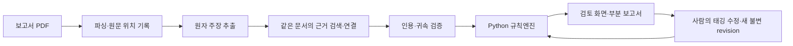

# ESG ProofOps

**지속가능성 공시의 환경 관련 주장을 발간 전에 근거와 함께 검토하는 도구입니다.** 기업의 실제 환경성과나 위법 여부를 판정하지 않습니다. 각 주장에 대해 같은 공시의 어느 문장·표·쪽이 근거인지, 무엇이 빠졌는지, 사람의 확인이 어디에 필요한지를 보여줍니다.

## 문제와 작동 방식

긴 보고서에서는 목표, 실적, 관리체계 주장이 본문과 표에 흩어져 있습니다. ProofOps는 원자 주장으로 나누고 원문 위치를 보존해 검토자가 주장과 근거를 왕복할 수 있게 합니다.



Upstage 모델은 **추출과 태깅만** 맡습니다. E0~E3 등급과 라벨은 순수 Python 규칙엔진이 계산합니다. 검증되지 않은 원문을 `present`로 인정하지 않으며, `unknown`·`conflict`·`unreadable`을 근거 부재로 바꾸지 않습니다. 미정 규칙은 등급을 꾸며내는 대신 판정을 보류합니다. 사람은 태깅을 수정하며 기존 결과와 감사 기록은 보존됩니다. [도메인 계약](docs/00_MASTER_SPEC.md) · [미정 규칙](docs/31_DOMAIN_IMPLEMENTATION_GAPS.md)

## 구성

| 영역 | 구현 |
| --- | --- |
| 검토 화면 | React, TypeScript, Vite (`apps/web/`) |
| API·작업 처리 | FastAPI, Python 워커 (`apps/api/`, `apps/worker/`) |
| 주장·근거·규칙 | Python 도메인·애플리케이션·로컬 어댑터 (`packages/proofops/`) |
| 모델 연결 | Upstage 추출·태깅 어댑터 (`apps/agent/`), 명시적 호출·예산 제한 |
| 로컬 상태 | SQLite와 로컬 객체 저장소; 원문 버전·출처·규칙 해시 보존 |
| 계약·검증 | `contracts/`, `tests/`, `evidence/` |

AWS 배포 구조는 [명세](docs/00_MASTER_SPEC.md)에 기록되어 있습니다. 로컬 실증과 AWS 운영 배포는 별개입니다.

## 확인된 부분 실행

아래는 개발 중 **실제 공개 보고서의 선택한 페이지**를 처리한 기록입니다. AI 위임 검토를 포함한 결과는 **사용자 최종 검토 전 초안**입니다. 숫자는 모델 정확도나 보고서 전체 처리율이 아닙니다.

| 기록 | 관찰 결과 | 출처 |
| --- | --- | --- |
| KB 보고서 물리 30쪽 로컬 실행 | 추출 후보 7개 중 원문 확인 2개, 미확인 5개. 태깅은 선행 조건 때문에 보류; 자동 등급 없음. | [실행 기록](evidence/developer-a-validation-20260918.md) |
| 삼성생명·한전 저장 결과 재생 | 각각 주장 2개·3개를 근거 후보와 연결. 원문 미검증으로 확정 등급 0개. | [재생 기록](evidence/source-linked-demo-verification.md) |
| NAVER 공개 시연 스냅샷 | 244쪽 중 54쪽 부분 실행. 주장 331개, 원문 검증 272개, 저장된 E3 17개. AI 위임 검토이며 독립 평가 정확도가 아님. | `apps/web/public/demo/naver-2025.json` |
| 기아 원문 대조 시험 | 28쪽 대상 28블록 중 15개 일치, 주장 8개 중 4개 원문 검증·모두 검토 필요. 보증 페이지 대상 152블록 중 27개 일치, 52개 미처리. | [본문 없는 검증 수치](evidence/kia-native-api-validation-20260929.json) |

공개 화면의 `/validation/kia`는 기아 검증 수치와 보류 상태를 보여 줍니다. 비공개 PDF 본문이나 기업 확정 등급을 공개하는 화면은 아닙니다.

## 추가 검토 기능

| 기능 | 실행·계약 안내 |
| --- | --- |
| Upstage 원문 이미지 대조와 오프라인 재생 | [새 실행의 OCR 정책](docs/NATIVE_UPSTAGE_OCR.md) |
| Solar Pro 3 추출·태깅 모델 고정 | [모델 선택과 기존 실행 호환성](docs/SOLAR_PRO3_TAGGING.md) |
| 전체 검색 증빙과 명시적 부재 검토 | [검색 범위 증빙](docs/search-coverage-receipt-contract.md) · [검토 연결](docs/absence-review-link-contract.md) |
| 본문·표 수치 대조 P6 | [검증된 차원 결속과 검토 CLI](docs/NUMERIC_P6_LINK.md) |
| 세이프하버 체크리스트 | [원문 근거 입력 CLI](docs/SAFE_HARBOR_CHECKLIST_PRODUCER.md) — 법적 효력·등급은 미정 |
| 산업별 프로젝트 검토 | [주제 검토·명시적 비적용 승인](docs/industry-topic-review-contract.md) — 공식 대응표·만족도는 미정 |

구현과 실제 보고서 적용의 차이, 미정 정책, 배포 상태는 [계획서 대비 현황](docs/SUBMISSION_PLAN_REMAINING_20260929.md)에 기록합니다.

## 로컬 실행

Python 3.12, `uv`, Node.js, `pnpm`이 필요합니다.

```bash
uv sync --locked
pnpm install --frozen-lockfile
```

**API 비용 없이 저장 결과 열기:** 권리가 확인된 기존 pilot 상태 디렉터리(`pilot.json` 포함)를 준비한 뒤 실행합니다. 보고서 원본과 저장 결과는 재배포 권리가 확인되지 않아 이 저장소에 포함하지 않습니다. 실행기는 seed를 복사하며 유료 모델 호출을 하지 않습니다.

```bash
uv run python scripts/submission_demo.py --seed .local/saved-pilot-state --port 8790
```

출력된 로컬 로그인 URL을 엽니다. seed가 없다면 합성 로컬 모드에서 화면과 API를 비용 없이 확인할 수 있습니다(서로 다른 터미널에서 실행).

```bash
APP_ENV=local MODEL_ADAPTER=synthetic APP_ORIGIN=http://localhost:5173 uv run proofops-api
pnpm --dir apps/web dev
```

**새 PDF로 Upstage 실행:** 사용 권한이 있는 PDF와 별도 `.env.upstage.local`의 `UPSTAGE_API_KEY`가 필요합니다. 먼저 아래 명령으로 입력 계획을 확인하고, 실제 유료 실행을 승인한 경우에만 끝에 `--invoke`를 붙입니다. 선택한 쪽만 처리하는 제한된 실행입니다. [세부 실행 방법](docs/SUBMISSION_DEMO.md)

```bash
uv run python scripts/analyze_report.py --pdf /path/to/report.pdf \
  --pages 25,117,138 --report-year 2025 \
  --period-start 2025-01-01 --period-end 2025-12-31
```

## 배포와 한계

배포: **서비스 소개·NAVER 실제 결과 데모 <https://esg-proofops.vercel.app>** (`/demo`) · **라이브 미니 파이프라인 <https://esg-proofops.vercel.app/live>** (접근 코드 필요, 2026-09-28 배포·실호출 확인). 데모의 NAVER 결과는 저장된 실제 실행 결과를 보여 주는 것이며, 라이브 페이지는 입력한 한 문장만 분류·태깅·규칙엔진으로 처리합니다(원문 PDF 검증 없음, 모델 1회 호출). 새 PDF 전체 분석은 로컬 실행으로 수행합니다.

현재 실증은 선택한 페이지와 로컬 상태에 한정됩니다. 원문 판독 불가, 근거 귀속 충돌, 승인되지 않은 규칙은 보류 상태로 남습니다. 독립적인 정답 자료에 대한 정확도, 전체 보고서 처리 성능, AWS 운영 환경, 법적 면책 효과는 검증됐다고 주장하지 않습니다.

## 팀과 권리

개발자 A는 공시 파이프라인, 개발자 B는 DART·재무 연계, 도메인 담당은 원문·규칙 계약을 맡는 방식으로 작업했습니다. Orca에서 위임한 AI 에이전트의 제안은 코드·원문 근거·검증 기록을 통해 통합했으며, AI 검토 결과 자체를 독립적인 정답으로 취급하지 않습니다. [개발 기록](docs/IMPLEMENTATION_STATUS.md)

이 저장소의 코드에는 별도 `LICENSE` 파일이 없으므로 사용·재배포 허가를 추정하지 마세요. 제3자 보고서 PDF·페이지 이미지의 재배포 권리도 확인되지 않았습니다. 공개 화면과 문서는 짧은 인용, 물리 쪽번호, 공식 보고서 링크만 사용해야 합니다.

<details><summary>English summary</summary>

ProofOps reviews environmental claims in sustainability disclosures against evidence in the same report before publication. AI extracts and tags; a deterministic Python rule engine computes grades, while unresolved evidence or rules remain pending. Local demos replay saved results without model calls; live analysis requires an authorized report and an explicit Upstage invocation. Results are drafts pending final user review, not accuracy or legal-compliance claims.

</details>
